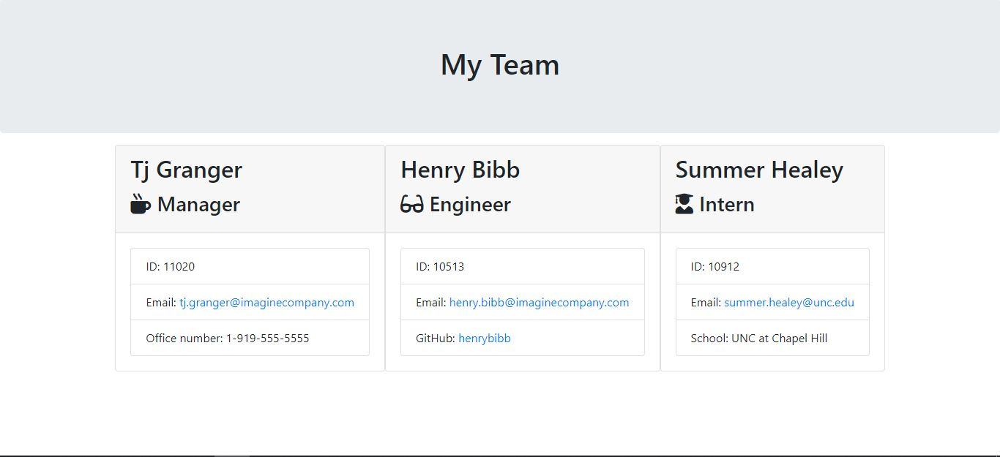

# Employee Summary Generator
  

# Employee Summary Generator Guidelines

This is a a software engineering team generator command line application that dynamically generates a visual team summary with user's input using the [Inquirer package](https://www.npmjs.com/package/inquirer). The application will be invoked with the following command:

```
node app.js
```
This application will prompt the user for information about the team manager and then information about the team members. The user can input any number of team members, and they may be a mix of engineers and interns. This generator has passed all unit tests. When the user has completed building the team, the application will create an HTML file that displays a nicely formatted team roster based on the information provided by the user. 

The specific features of the application are outlined in the acceptance criteria provided by the client. 

# Acceptance Criteria Requirements:

Functional application includes the following:

* Functional application that accepts user input

* Generates a webpage that displays my team's basic info: 

    * Name
    * E-mail
    * I.D.

* Team should consist of one manager and any number of engineers and interns 

* Interns should include their education institution in their summary

* Engineers should include their Github in their summary

* Includes Inquirer and Jest as listed dependencies in package.json

* Uses Jest dependency and passes tests located in the 'test' folder  

The following animation demonstrates the client's request for application functionality:

Client Demo:


Application Demo: 


Video Demo:


GitHub Repository: https://github.com/summerhealey/employee-summary/ 

# Criteria Determination: 

This application provides a fully functional command line application using Node.js, Inquirer.js, and Jest.js to generate a visual employee team summary for the client. 

For additional information, please e-mail the project manager [Summer Healey](https://github.com/summerhealey/): summerleigh.healey@gmail.com.

